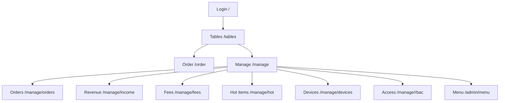
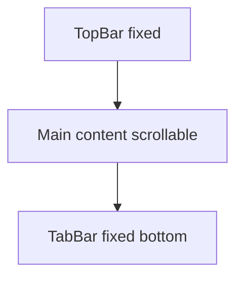
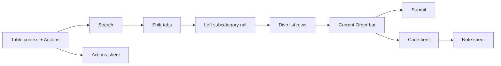

# Design Schema

## Native Android migration

`android/app/src/main/java/com/rdv/order/ui/` implements native counterparts to login, tables, ordering and seven management modules. Managers enter Orders after login; waiters enter Tables. Existing web cashier/ops routes redirect to Revenue; summary has no normal navigation entry. Native business screens retain the table columns, category/menu/cart regions, role entry points, ordinary Add → cart, seafood Add → note, and server action order. Internal builds add a one-time test-server setup page; release binds the origin at build time. CSV uses Android's save-file picker. Visual and business equivalence remain subject to `android-acceptance.md`.

## Navigation Information Architecture

## App Shell Schema

## Order Page Interaction Schema

## Layer Schema (z-index)
- Base content: `--z-base`
- AppBar/TabBar: `--z-appbar` / `--z-tabbar`
- Sticky action bars: `--z-actionbar`
- BottomSheet/Modal: `--z-sheet`
- Toast: `--z-toast`
- Blocking full-screen overlay: `--z-overlay-blocking`

## Screen Structure Notes
- Tables: 3-column board with status cards (green/red)
- Order: fixed header + category rail + dish list + sticky cart bar
- Manage: module entry list + subpages with `Back` AppBar action
