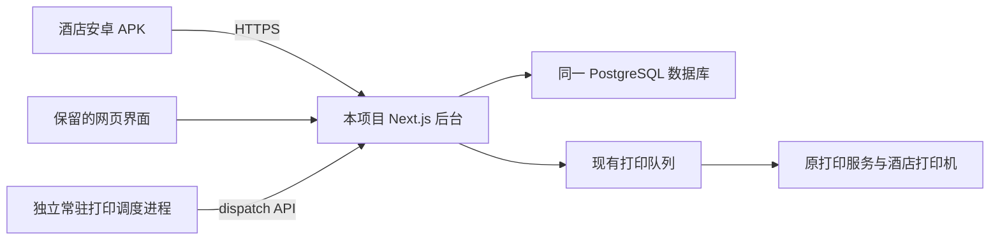

# 酒店点餐软件：首次运行与交付

## 当前事实

用户说明现有软件是本地 WebApp，认为尚未 push 和部署；不能继续以“已有线上酒店网址”为前提。仓库已配置 GitHub remote，但本轮没有检查远端代码完整性、push 或创建部署。配置中存在远程 PostgreSQL 连接及 XPYUN 打印相关变量；这只能证明有配置，不能证明数据库、打印机或后台服务已经正常运行。检查未输出凭据，也未对该数据库/打印机发送测试业务。

当前原生 APK 是客户端。原有 Next.js 项目同时包含网页和 `/api/` 后台，数据库和打印密钥仍在服务端。要让酒店设备真正点菜，需要让这套后台持续运行，并让 APK 访问它。上传 Git 代码、运行后台和安装 APK 是三个分别需要完成的步骤。

## 建议的最终结构

用户已选择云端运行。准备一个常驻 Next.js 服务和一个独立打印调度进程。具体平台、部署地区、费用、账号和外部部署尚未确定；酒店所在地和已有云账号已询问，不先购买服务或创建公开部署。

现有 Next.js 可按 Node 服务运行；不是只有静态 HTML，不能仅上传前端文件来代替业务后台。[Next.js 15 部署与自托管说明](https://nextjs.org/docs/15/app/guides/self-hosting)说明了服务端运行与环境变量边界。本项目实际使用的后台路径、数据库访问和打印队列以仓库源码为准。

## 完整交付的剩余工作

| 步骤 | 工程工作 | 完成条件 |
| --- | --- | --- |
| 1. 对齐迁移 | 将本目录 WebApp 的按钮、输入、权限、菜单和结果与原生逐项比较，补齐差异 | `android-acceptance.md` 各功能有实际证据，不只验证空页面加载 |
| 2. 运行后台 | 云端已确定，准备同一项目的构建/启动、HTTPS、服务端配置、重启与日志；先用隔离环境联调 | APK 能通过真实 HTTP 调用本项目后台，登录/菜单/桌台/订单可完整读写 |
| 3. 核对数据 | 确认现有数据库属于开发还是营业环境、迁移版本、账号和菜单；测试数据与酒店数据隔离 | 金额、桌台、菜单和权限基线一致；不盲目清库或重新 seed |
| 4. 接通打印 | 验证调度方式、重试、provider 和实际纸单；当前下单只写队列，不能假设已自动唤醒 worker | 厨房单/收据的内容、份数及失败重试符合原业务预期 |
| 5. 完整回归 | 管理 CRUD、退菜/费用/反结账、CSV 文件保存、弱网/并发、进程重建、目标设备 | 逐项通过，阻止营业及影响金额/打印的问题清零 |
| 6. 正式 APK | 绑定后台根地址，确认长期签名及备份，验证 release 构建和覆盖升级 | 酒店设备可安装、升级、登录并实际使用；保留网页与回退说明 |

工程内能完成的修复、测试和部署准备继续进行。真正需要用户提供/裁定的是酒店所在地、云账号/费用、设备型号，以及数据库和打印环境是否可作为测试环境。现阶段不能把模拟测试通过等同于酒店已能营业使用。

## 可执行的云端配置草案

本阶段使用现有仓库的 Node 部署方式，平台仍待地区与账号信息确认。Railway 可作为候选：官方支持从已有 Next.js 仓库部署，无需重建点餐软件。其 Pro 方案面向生产使用，基础价格为每月 20 美元，抵扣资源用量，超出另计。这只是平台最低费用，不包含现有数据库、打印服务、域名等外部费用，也不是最终账单承诺。2026-09-07 查阅：[Next.js 部署](https://docs.railway.com/guides/nextjs)、[套餐与资源价格](https://docs.railway.com/pricing/plans)。酒店网络到候选地区的实际连通性需要验证后再选定平台。

| 服务 | 源码 / 构建 / 启动 | 运行要求 |
| --- | --- | --- |
| Web 与 API | 本仓库根目录；`npm ci` → `npm run build` → `npm start` | HTTPS 根网址、平台指定 PORT、持续运行、进程异常重启；禁止仅静态导出 |
| 打印调度 | 同一份代码；无需 Android 或 Next 构建；`npm run worker:print` | 单实例、持续运行、启动等待 60 秒、停机宽限至少 65 秒；先隔离联调后启用 |
| PostgreSQL | 先核实现有配置所属环境与版本 | 暂不迁移供应商、不重新 seed；测试使用独立数据，营业前验证备份及恢复 |

上述 Node 启动方式已在本机通过 Next 生产构建，但没有在云端创建服务或验证云端运行。选择平台后固定 Node 版本，重新检查平台构建、运行、HTTPS、重启、日志和费用告警。平台进程健康检查只代表服务存活，不能替代数据库读写和实际打印验收。

### 配置归属（不记录真实值）

| 变量 | 类型 / 所属进程 | 维护者与核查方式 |
| --- | --- | --- |
| APK 根地址 | 公开配置 / 安卓构建 | 用户持有的后台域名；证书、根路径和真实登录核查 |
| `DATABASE_URL` | 服务端秘密 / Web | 用户的数据库账号；隔离环境和营业环境分开，核查迁移及备份 |
| `JWT_SECRET` | 服务端秘密 / Web | 用户持有的云平台变量；长随机值，测试与营业独立；更换会使会话失效 |
| `PRINT_PROVIDER` 及对应 provider 凭据 | 服务端配置与秘密 / Web | 原打印账号；核查 provider、SN、份数及路由，不抄入 APK |
| `PRINT_WORKER_KEY` | 服务端秘密 / Web 与调度进程 | 两进程同环境共享；通过平台秘密变量注入；更换后协调重启 |
| `PRINT_DISPATCH_ORIGIN` | 服务端配置 / 调度进程 | Web 的 HTTPS 根地址；脚本拒绝带凭据、路径、查询参数及公网 HTTP |
| `DEVICE_HEARTBEAT_KEY` | 服务端秘密 / 实际启用心跳的组件 | 按现有设备是否接入核查，不把变量已填当作设备在线 |

`.env.example` 只放占位内容，真实 `.env*` 均忽略。云端秘密放平台变量中；本轮未输出、迁移、轮换任何真实秘密。发现泄露、所有权变更或用户要求时再执行轮换，并协调更新依赖服务。CI 构建需要的秘密仅放 CI 私密变量，避免把营业数据库/打印权限给普通测试。

### 上线顺序与回退

1. 核实酒店所在地、用户拥有的云账号、候选地区连通性和费用。明确可发布的代码版本后再 push/创建部署。
2. 准备隔离 PostgreSQL 与假打印服务。核对现有迁移和数据来源，不运行面向营业库的初始化或 seed。建立测试账号和菜单基线。
3. 部署 Web/API，保持自动打印进程关闭。验证 HTTPS、登录、权限、菜单、桌台、提交/幂等恢复、金额、管理 CRUD 与 CSV；同时对照原网页操作结果。
4. 在隔离环境启用调度，验证空队列、正常单、失败重试、退出重启、权限失效与日志。检查部署替换时是否同时运行新旧实例，避免双调度。
5. 保存数据库备份并验证恢复；确认旧队列处理方式、真实打印机 SN/份数、测试单授权，然后联调酒店网络和纸单。不把历史待打印任务直接带入自动启用。
6. 通过验收后，使用用户长期持有并备份的签名密钥制作固定后台地址的 release APK，在目标设备检查首次安装和覆盖升级。保留原网页入口及前一版 APK。
7. 回退时先停新增写入并处理不确定订单，停止自动调度（已受理请求仍可能完成）；回退到已验证兼容数据库的服务版本。数据库回退必须按备份恢复方案单独执行，不能清库、删队列或重复下单来替代。首次上线前没有可用的线上旧版本，网页备用入口也依赖同一后台，不等于后台容灾。

下一步：确认酒店所在地和已有云账号，选定地区与费用后创建隔离云端环境。
