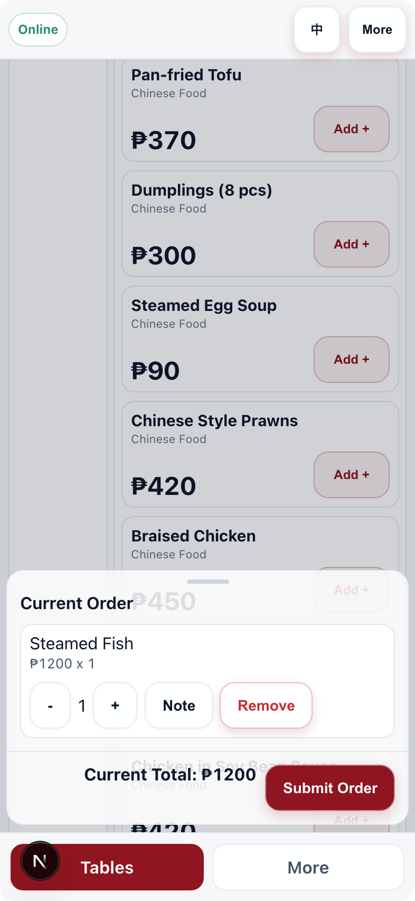
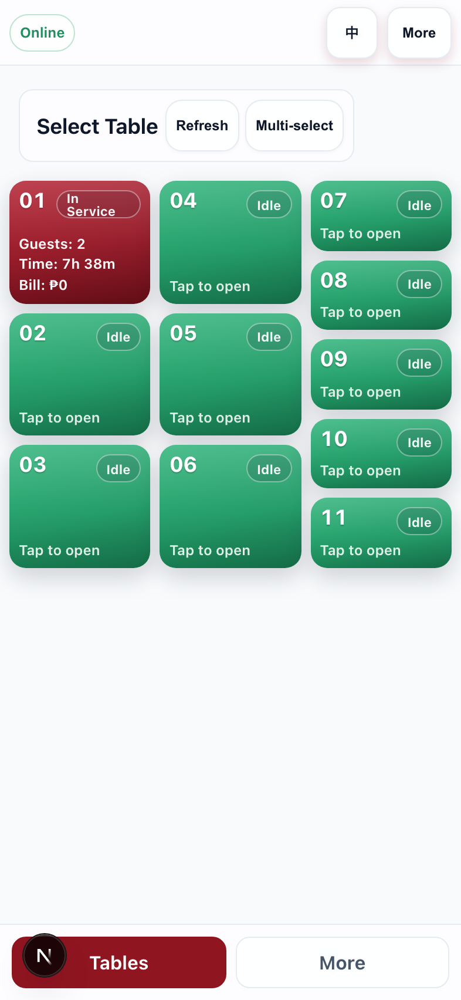
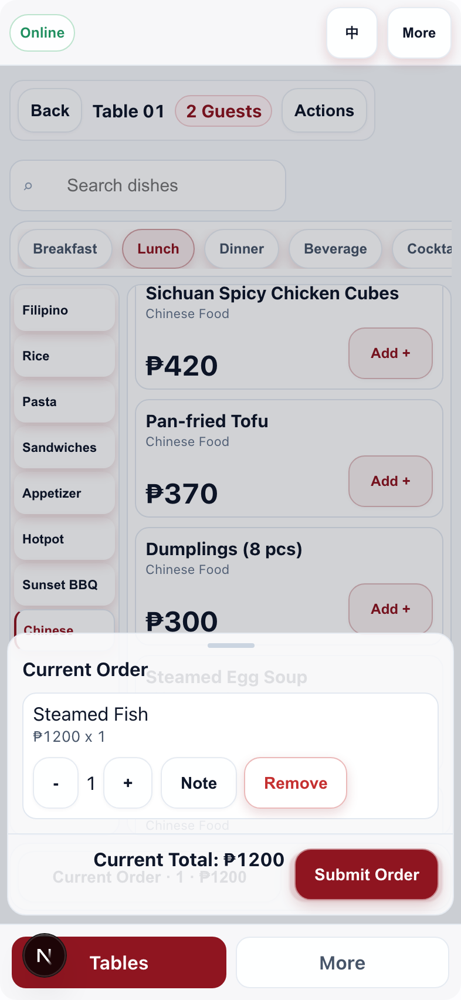
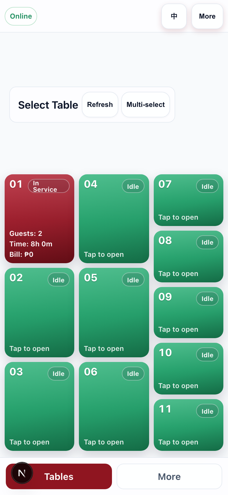

# Performance Sprint（2026-03-07）

## 1. 复现与采样方法

### 1.1 基线采样（优化前）
1. 启动：`npm run dev`（`http://localhost:3002`）。
2. 运行性能脚本：`node scripts/perf/profile.mjs docs/perf-assets before`。
3. 产物：
   - `docs/perf-assets/before.json`
   - `docs/perf-assets/before-order.png`
   - `docs/perf-assets/before-tables.png`

### 1.2 优化后采样
1. 保持同样环境与脚本。
2. 运行：`node scripts/perf/profile.mjs docs/perf-assets after`。
3. 产物：
   - `docs/perf-assets/after.json`
   - `docs/perf-assets/after-order.png`
   - `docs/perf-assets/after-tables.png`

### 1.3 包体统计
- 优化前：`/tmp/rdv-build-before.log`
- 优化后：`/tmp/rdv-build-after-clean.log`

### 1.4 Smoke Test（选桌→加菜→submit→revenue）
- 使用生产模式验证（避免 dev cache 干扰）：
  1. `node -e "fs.rmSync('.next',{recursive:true,force:true})"`
  2. `npm run build`
  3. `npm run start -- -p 3003`
  4. 通过 API 流程执行：开台 -> 下单 -> 结账 -> 查询 `manage/income`
- 本次结果：
  - `tableNo=02`
  - `orderId=47b82580-d83d-4fbd-9715-d54cd37b5097`
  - `checkoutOrders=1`
  - `revenueOrders=12`
  - `revenueTotal=10565`

## 2. 主要瓶颈与证据

### A) 视觉效果（毛玻璃/阴影/透明叠层）导致卡顿
证据：
- 优化前 `sheetPerf.longTaskCount=10`，`sheetPerf.longTaskTotalMs=515`，`sheetTrace.scriptMs=580.6`。
- 在同一基线会话中临时关闭高成本视觉层后（visual bypass），`longTaskTotalMs` 降到 `454`（约 -11.8%）。
- 说明弹层/叠层期间视觉特效与脚本合成开销叠加，造成明显长任务。

### B) 菜品/桌台列表 DOM 过多
证据：
- 优化前最大分类可见菜品行 `23`（`categoryProbe.count=23`），页面节点 `264`。
- 单行结构平均节点 `7`，累计节点放大后导致滚动与状态更新成本上升。

### C) React 全页重渲染（state 设计）
证据（`+1` 操作 CPU profile）：
- 优化前：`addResult.latencyMs=58.6ms`，`addCpu.reactRenderMs=1.13`，`localizeMenuTextMs=1.16`（说明点击单行时仍触发较广渲染路径）。
- 优化后：`addResult.latencyMs=37.7ms`（-35.7%），`reactRenderMs=0.38`（-66.4%），`localizeMenuTextMs=0`。

### D) layout/reflow（fixed/safe-area/多滚动容器）
证据：
- 优化前主滚动目标在根容器：`targetClass="app-shell-main has-tabbar"`。
- 优化后主滚动目标切换为菜单容器：`targetClass="page_menuPane__..."`，并锁定根滚动（`app-shell-main--locked`），减少根级滚动与内部滚动混用引发的重排风险。

### E) 资源与包体
证据：
- 生产依赖从 `6` 个降为 `5` 个（`pdf-parse` 移至 `devDependencies`）。
- 低频 Manage 路径取消 eager prefetch（底部导航 `prefetch={false}`，登录页不再预取 `/manage/orders`）。
- 新增静态资源缓存头（`/icons/*` 长缓存 immutable，`/menus/*` 短缓存 + SWR）。
- Build 对比：`/order` 首包 `128kB -> 129kB`（本次重构以运行时性能为主，包体基本持平）。

## 3. 优化措施（已落地）

### A. 视觉层收敛
- 仅保留 AppBar/TabBar/BottomSheet 毛玻璃。
- 移除 `order` 页 `shiftPanel/cartDock` 毛玻璃与重阴影。
- 移除 `topbar-menu` 毛玻璃。

### B. 防止全页重渲染
- 菜单元数据与点单选择状态解耦（`menu` 不再携带 `qty/note`）。
- 菜品行与分类按钮使用 `memo`。
- 稳定回调（`useCallback`），减少 inline 触发的无效子树渲染。
- 桌台卡片组件 memo 化。

### C. 列表优化
- 菜品列表超过阈值时按需渲染（首屏 18 条，滚动增量加载）。
- 桌台列表增加阈值下的渐进渲染保护（超大规模时按批加载）。

### D. 滚动与布局
- `order` 路由锁定根滚动，菜单区作为主滚动容器。
- `app-main` 高度约束，避免根层与子层滚动竞争。
- Toast 入场动画统一使用 `transform/opacity`。
- 统一 `--viewport-h`（`100dvh` + `100vh` fallback）与 safe-area 布局变量。

### E. 资源与包体
- `pdf-parse` 从生产依赖移到开发依赖。
- Manage 低频路径取消主动预取。
- 静态资源缓存策略强化。

## 4. 前后对比（关键数字）

| 指标 | Before | After | 结果 |
|---|---:|---:|---:|
| 菜单可见行数（同分类） | 23 | 18 | -21.7% |
| 页面 DOM 节点（order） | 264 | 230 | -12.9% |
| `+1` 响应时延 | 58.6ms | 37.7ms | -35.7% |
| 弹层场景 long tasks 数 | 10 | 0 | 明显改善 |
| 弹层场景 long tasks 总时长 | 515ms | 0ms | -100% |
| 弹层场景脚本时间（trace） | 580.6ms | 324.88ms | -44.0% |

> 结论：滚动/切换/弹层阶段长任务显著减少，`+1` 体感响应明显加快；功能路径（开台→下单→结账→revenue）无回归。

## 5. 关键截图

### 优化前

### 优化后

## 6. 提交记录（小步提交）
- `6ba6582` `perf(A): restrict glass effects to app bars, tab bar, and sheets`
- `b9eaac1` `perf(B): split order selection state and memoize heavy list rows`
- `cc3071c` `perf(C): add threshold-based progressive rendering for menu and tables`
- `fba3168` `perf(D): lock root scroll on order page and use transform-only toast motion`
- `f2e68f3` `perf(D): constrain app main height for single-scroll order layout`
- `6eb1696` `perf(E): reduce low-frequency prefetch and tighten static asset caching`
